[TOC]

 

# EKF vs ESKF

- 运动方程

$$
\begin{align*}
\mathbf{x}_k &= f(\mathbf{x}_{k-1},\mathbf{u}_k) + \mathbf{w}_k \\ 
&\approx f(\hat{\mathbf{x}}_{k-1},\mathbf{u}_k) + \frac{\partial f}{\partial \mathbf{x}_{k-1}} \Bigr|_{ \hat{\mathbf{x}}_{k-1}} (\mathbf{x}_{k-1} - \hat{\mathbf{x}}_{k-1}) + \mathbf{w}_k \\
&= f(\hat{\mathbf{x}}_{k-1},\mathbf{u}_k) + \mathbf{F}(\mathbf{x}_{k-1} - \hat{\mathbf{x}}_{k-1})  + \mathbf{w}_k
\\ \\
P(\mathbf{x_{k-1}}) &\sim N(\hat{\mathbf{x}}_{k-1},\hat{\mathbf{P}}_{k-1}) \\
P(\mathbf{w}_k) &\sim N(\mathbf{0},\mathbf{R}_k) \\

P(\mathbf{x}_k|\mathbf{x}_{k-1},\mathbf{u}_k) &\sim N(f(\hat{\mathbf{x}}_{k-1},\mathbf{u}_k) + \mathbf{F}(\mathbf{x}_{k-1} - \hat{\mathbf{x}}_{k-1}) , \mathbf{R}_k)

\end{align*}
$$


- 观测方程

$$
\begin{align*}
\mathbf{z}_k &= h(\mathbf{x}_k) + \mathbf{v}_k \\
&= h(\bar{\mathbf{x}}_k) + \frac{\partial h}{ \partial \mathbf{x}_k} \Bigr|_{\bar{x}_k}(\mathbf{x}_k-\bar{\mathbf{x}}_k) + \mathbf{v}_k \\
&= h(\bar{\mathbf{x}}_k) + H(\mathbf{x}_k-\bar{\mathbf{x}}_k) + \mathbf{v}_k

\\
\\
P(\mathbf{v_k}) &\sim N(\mathbf{0}, \mathbf{Q}_k) \\

P(\mathbf{z}_k | \mathbf{x}_k) &\sim N(h(\bar{\mathbf{x}}_k)+H(\mathbf{x}_k-\bar{\mathbf{x}}_k) ,\mathbf{Q}_k)

\end{align*}
$$


|                                                              |                                                              |                                                              |
| ------------------------------------------------------------ | ------------------------------------------------------------ | ------------------------------------------------------------ |
|                                                              | EKF                                                          | ESKF <br> ( $ x_{k} =  x_{nk} +  \delta{x_k} $)              |
| predict: $ \bar{P}(x_k) = \int P(x_k |x_{k-1},u_k) P(x_{k-1}) dx_{k-1} = N(\bar{\mathbf{x}}_k,\bar{P}_k) $     <br>$\bar{P}(\delta{x}) = N(\bar{\delta{x}_k},\bar{P}_k)$ | $ \bar{\mathbf{x}}_k = f(\hat{\mathbf{x}}_{k-1},\mathbf{u}_k) \\ \bar{\mathbf{P}}_k = \mathbf{F} \hat{\mathbf{P}}_{k-1} \mathbf{F}^T + \mathbf{R}_k  $ | $ \mathbf{x}_{nk} =f(\hat{\mathbf{x}}_{k-1},\mathbf{u}_k)  \\ \bar{\mathbf{\delta{x}}}_k = \mathbf{0} \\ \bar{\mathbf{P}}_k = \mathbf{F} \hat{\mathbf{P}}_{k-1} \mathbf{F}^T + \mathbf{R}_k $ |
| update $ P(x_k)=\eta P(z_k|x_k)\bar{P}(x_k) = N(\hat{x},\hat{P}_k) $ | $ \mathbf{K_k} = \mathbf{\bar{P}}_k \mathbf{H}^T(\mathbf{H}\mathbf{\bar{P}}_k \mathbf{H}^T+\mathbf{Q}_k)^{-1}  \\ \hat{\mathbf{x}}_k=\bar{\mathbf{x}}_k+\mathbf{K}_k(\mathbf{z}_k - h(\bar{\mathbf{x}}_k)) \\  \hat{\mathbf{P}}_k = (\mathbf{I}-\mathbf{K}_k \mathbf{H})\bar{\mathbf{P}}_k$ | $ \mathbf{K_k} = \mathbf{\bar{P}}_k \mathbf{H}^T(\mathbf{H}\mathbf{\bar{P}}_k \mathbf{H}^T+\mathbf{Q}_k)^{-1}  \\ \hat{\mathbf{\delta x}}_k = \mathbf{K}_k(\mathbf{z}_k - h(\bar{\mathbf{x}}_k)) \\  \hat{\mathbf{P}}_k = (\mathbf{I}-\mathbf{K}_k \mathbf{H})\bar{\mathbf{P}}_k \\ \\ \mathbf{x}_{nk} += \hat{\mathbf{\delta x}}_k \\ \\ [ \delta \mathbf{x} \leftarrow g(\delta \mathbf{x})=\delta \mathbf{x} \ominus \hat{\delta \mathbf{x}} ] \\ \\ \hat{\mathbf{\delta{x}}}_k = \mathbf{0}  \\ \hat{\mathbf{P}}_k =  $ |
|                                                              | $K_k$的作用有两方面： 1) $H^T$ 将观测域误差变换到状态域 2）两者的方差构成的一个权重增益g |                                                              |

 $x_k​$是True state ，$x_{nk}​$是Nominal state 它是确定值 , $\delta{x_k}​$ 是Error state 它是一个分布


基本概念

- true-state $x_t​$ 
- nominal-state $x$  标准状态：不考虑噪声$w$和模型偏置$b$ 会有累计误差 （例如IMU数据会被集成到nominal-state）
- error-state $\tilde x$ 或 $\delta x$ 误差状态： 偏置和误差统一放在 $\delta x$ 并由ESKF来估计(对error-state做KF) 考虑所有的噪声和扰动项。 它是小信号量级。evolution function 是一个(时变)线性动力系统。its dynamic, control and measurement matrices computed from the values of the nominal-state
- 预测：使用IMU信息/高频率 1) nominal-state通过运动方程作积分进行预测(写代码时一般只维护$x$和 $\delta x$)   2) ESKF predicts a Gaussian estimate of the error-state
- 更新：使用其他信息(GPS vision)/低频率 1)  provides a posterior Gaussian estimate of the
  error-state 通过观测的到后验的误差状态  2) error-state’s mean is injected into the nominal-state then reset to zero，error-state’s covariances matrix is conveniently updated to reflect this reset


# 总体思路

## 符号说明

- $\dot{x}​$ 表示微分
- $\tilde{x}$ 表示误差
- $\hat{x}$ 表示估计值
- $x_m$ 表示测量值
- $G$ 惯性系
- $C$ 相机系
- $I$ IMU坐标系
- $^{G}\textrm{p}$ G坐标系下一个点
- $_{A}^{B}R$ 从A坐标系到B坐标系的旋转矩阵


## 状态变化过程图解


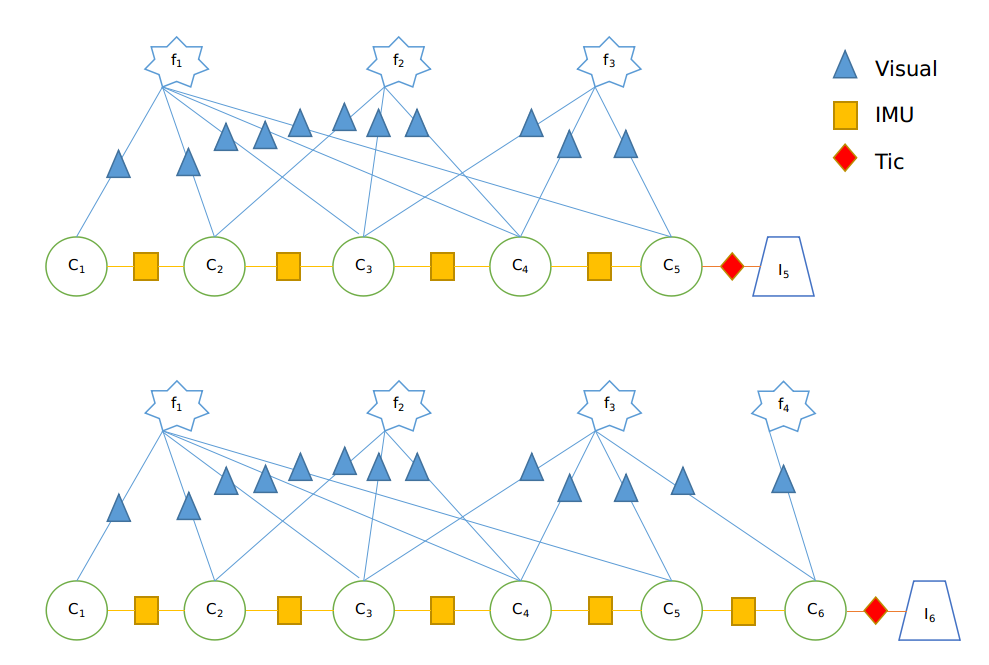


当新来一帧图像$C_6$时，此时的状态由 $[I_5, C_1,C_2,C_3,C_4,C_5] $ 变成了 $[I_6,C_1,C_2,C_3,C_4,C_5,C_6]$

可以将系统状态分成IMU状态(即新增的$I_6$)和Camera状态(主要是新增了$C_6 $)。

**预测阶段**就是分别对这两个部分进行预测：

- 预测IMU状态： nominal-state / error-state  对应函数为batchImuProcessing
  - 预测nominal-state中的IMU部分： 利用$I_5,I_6$之间的IMU数据根据IMU的运动方程积分得到$I_6$。
  - 预测error-state中的IMU部分: 1) 误差状态的均值是0所以不用管， 2) 预测误差状态中所有IMU相关的协方差。
- 预测Camera状态：nominal-state / error-state 对应函数为stateAugmentation
  - 预测nominal-state中的Camera部分：其实就是新增一个$C_6$相关状态
  - 预测error-state中的Camera部分：1) 误差状态的均值是0所以不用管，2) 预测误差状态中所有Camera相关的协方差
- addFeatureObservations：建立$C_6​$与已跟踪特征点的链接关系

**更新阶段**

- 筛选出待更新的视觉约束关系(即“特征点和对应的相机状态”)计算观测矩阵H , 其中removeLostFeatures是根据特征点来选， pruneCamStateBuffer是根据移除的相机状态来选  （所以这两种是否可以合并呢？ 更新完只有要删除部分特征点和部分相机状态及其协方差）
- 计算kalman增益K，计算误差状态的后验估计和协方差。对应函数为measurementUpdate
- 更新nominal-state，重置error-state


## 数学描述

系统状态为： $\tilde{\mathbf{x}}=\left( \begin{array}{cccc}{\tilde{\mathbf{x}}_{I}^{\top}} & {\tilde{\mathbf{x}}_{C_{1}}^{\top}} & {\cdots} & {\tilde{\mathbf{x}}_{C_{N}}^{\top}}\end{array}\right)^{\top}​$

- $\tilde{\mathbf{x}}_{I}=\left( \begin{array}{cccccccc}{} & _{G}^{I}\tilde{\boldsymbol{\theta}}^{\top} & {\tilde{\mathbf{b}}_{g}^{\top}} & ^G{\tilde{\mathbf{v}}_{I}^{\top}} & {\tilde{\mathbf{b}}_{a}^{\top}} &  ^G{\tilde{\mathbf{p}}_{I}^{\top}} & _{C}^{I}\tilde{\boldsymbol{\theta}}^{\top}  & {^{I} \tilde{\mathbf{p}}_{C}^{\top}}\end{array}\right)^{\top}​$
  - $^{G} \tilde{\mathbf{p}}_{I}=^{G} \mathbf{p}_{I}-^{G} \hat{\mathbf{p}}_{I}$ 
  -  $\delta \mathbf{q}=\mathbf{q} \otimes \hat{\mathbf{q}}^{-1}​$  $\delta \mathbf{q} \approx\left(\frac{1}{2} ^G_{I}\tilde{\boldsymbol{\theta}}^{\top} \quad 1\right)^{\top}​$
-  $\tilde{\mathbf{x}}_{C_{i}}=\left( \begin{array}{cc} {{_G^{C_{i}}}\tilde{\boldsymbol{\theta}}^{\top}} & ^G\tilde{\mathbf{p}}_{C_{i}}^{\top} )^{\top} \end{array} \right)$

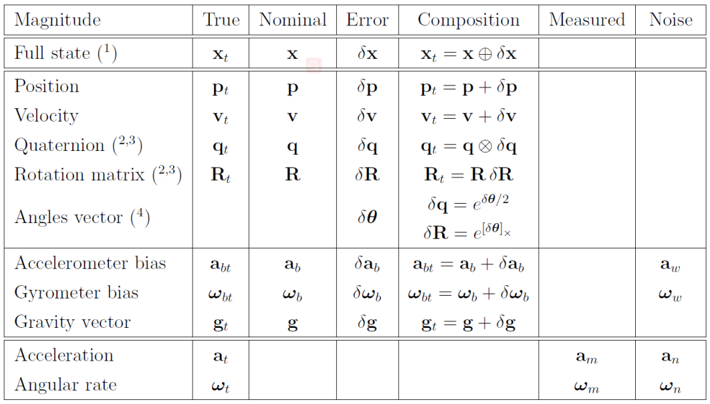

| Magnitude  | True             | Nominal      | Error                                       | Composition                                           | Measured | Noise |
| ---------- | ---------------- | ------------ | ------------------------------------------- | ----------------------------------------------------- | -------- | ----- |
| Full state | $\mathbf{x}_t $  | $\mathbf{x}$ | $\delta x$ / $\tilde{x} $                   | $\mathbf{x}_t = \mathbf{x} \oplus \delta \mathbf{x} $ |          |       |
| Position   | $\mathbf{p}_{t}$ | $\mathbf{p}$ | $\delta \mathbf{p}$ / $\tilde{p}$           | $\mathbf{p}_{t}=\mathbf{p}+\delta \mathbf{p}$         |          |       |
| Quaternion | $\mathbf{q}_t $  | $\mathbf{q}$ | $\mathbf{\delta}{q}$ / $\tilde{\mathbf{q}}$ | $\mathbf{q}_{t}=\mathbf{q} \otimes \delta \mathbf{q}$ |          |       |
| Velocity   | $\mathbf{v}_{t}$ | $\mathbf{v}$ | $\delta \mathbf{v}$                         | $\mathbf{v}_{t}=\mathbf{v}+\delta \mathbf{v}$         |          |       |
|            |                  |              |                                             |                                                       |          |       |
|            |                  |              |                                             |                                                       |          |       |
|            |                  |              |                                             |                                                       |          |       |
|            |                  |              |                                             |                                                       |          |       |
|            |                  |              |                                             |                                                       |          |       |


# 预测

## 预测IMU状态


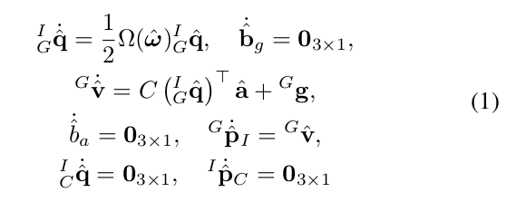

- $\hat{\omega}=\omega_{m}-\hat{\mathbf{b}}_{g}, \quad \hat{\mathbf{a}}=\mathbf{a}_{m}-\hat{\mathbf{b}}_{a}$
- $\Omega(\hat{\omega})=\left( \begin{array}{cc}{-\left[\hat{\omega}_{\times}\right]} & {\omega} \\ {-\omega^{\top}} & {0}\end{array}\right)$

linearized continuous time dynamics for the error IMU state $\dot{\tilde{\mathbf{x}}}_{I}=\mathbf{F} \tilde{\mathbf{x}}_{I}+\mathbf{G} \mathbf{n}_{I}$

- $\tilde{\mathbf{x}}_{I}=\left( \begin{array}{cccccccc}{} & _{G}^{I}\tilde{\boldsymbol{\theta}}^{\top} & {\tilde{\mathbf{b}}_{g}^{\top}} & ^G{\tilde{\mathbf{v}}_{I}^{\top}} & {\tilde{\mathbf{b}}_{a}^{\top}} &  ^G{\tilde{\mathbf{p}}_{I}^{\top}} & _{C}^{I}\tilde{\boldsymbol{\theta}}^{\top}  & {^{I} \tilde{\mathbf{p}}_{C}^{\top}}\end{array}\right)^{\top}$    $\delta \mathbf{q}=\mathbf{q} \otimes \hat{\mathbf{q}}^{-1}$      $\delta \mathbf{q} \approx\left(\frac{1}{2} ^G_{I}\tilde{\boldsymbol{\theta}}^{\top} \quad 1\right)^{\top}$ 
- $\mathbf{n}_{I}^{\top}=\left(\mathbf{n}_{g}^{\top} \mathbf{n}_{w g}^{\top} \mathbf{n}_{a}^{\top} \mathbf{n}_{w a}^{\top}\right)^{\top}​$
- 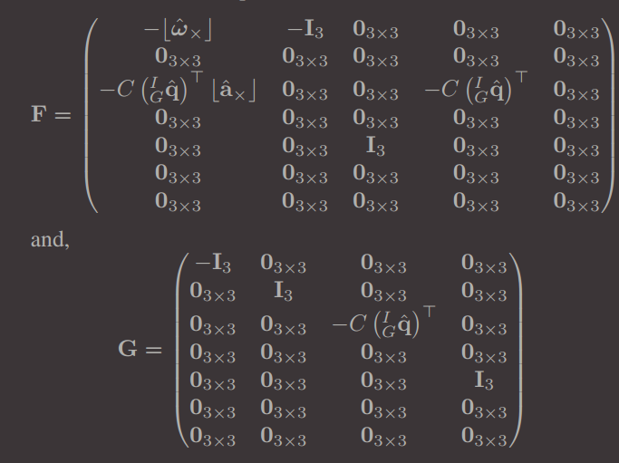


$$
F = 
\begin{pmatrix}
-\left\lfloor\hat{\omega}_{x}\right\rfloor & -\mathbf{I}_3 & \mathbf{0}_3 & \mathbf{0}_3 & \mathbf{0}_3 & \mathbf{0}_3 & \mathbf{0}_3 \\
\mathbf{0}_3 & \mathbf{0}_3 & \mathbf{0}_3 & \mathbf{0}_3 & \mathbf{0}_3 & \mathbf{0}_3 &　\mathbf{0}_3 \\
-C\left(_{G}^{I} \hat{\mathbf{q}}\right)^{\top}\left\lfloor\hat{\mathbf{a}}_{ \times}\right\rfloor & \mathbf{0}_3 & \mathbf{0}_3 & -C\left(^I_G\hat{\mathbf{q}}\right)^{\top} & \mathbf{0}_3 & \mathbf{0}_3 & \mathbf{0}_3 \\
\mathbf{0}_3 & \mathbf{0}_3 & \mathbf{0}_3 & \mathbf{0}_3 & \mathbf{0}_3 & \mathbf{0}_3 &　\mathbf{0}_3 \\ 
\mathbf{0}_3 & \mathbf{0}_3 & \mathbf{I}_3 & \mathbf{0}_3 & \mathbf{0}_3 & \mathbf{0}_3 &　\mathbf{0}_3 \\
\mathbf{0}_3 & \mathbf{0}_3 & \mathbf{0}_3 & \mathbf{0}_3 & \mathbf{0}_3 & \mathbf{0}_3 &　\mathbf{0}_3 \\
\mathbf{0}_3 & \mathbf{0}_3 & \mathbf{0}_3 & \mathbf{0}_3 & \mathbf{0}_3 & \mathbf{0}_3 &　\mathbf{0}_3 \\
\end{pmatrix} 
$$


linearized discrete time dynamics for the error IMU state   $\tilde{x}_{I_{k+1}} = \Phi \tilde{x}_{I_k}+n_I$ 

- 预测nominal-state中的IMU部分：通过积分来 预测角度、速度、位置
- 预测error-state中的IMU部分： 
  - 1) 误差状态的均值是0所以不用管
  - 2) 预测误差状态中所有IMU相关的协方差： 
    - $\mathbf{P}_{k | k}=\left( \begin{array}{cc}{\mathbf{P}_{I I_{k|k}}} & {\mathbf{P}_{I C_{k|k}}} \\ {\mathbf{P}_{I C_{k|k}}^{\top}} & {\mathbf{P}_{C C_{k | k}}}\end{array}\right)​$ -> $\mathbf{P}_{k+1 | k}=\left( \begin{array}{cc}{\mathbf{P}_{I I_{k+1|k}}} & {\Phi_{k} \mathbf{P}_{I C_{k|k}}} \\ {\mathbf{P}_{I C_{k|k}}^{\top} \Phi_{k}^{\top}} & {\mathbf{P}_{C C_{k | k}}}\end{array}\right)​$ 
    - $\mathbf{P}_{I I_{k+1|k}}=\Phi_{k} \mathbf{P}_{I I_{k | k}} \Phi_{k}^{\top}+\mathbf{Q}_{k}​$   $\mathbf{\Phi}_{k}=\boldsymbol{\Phi}\left(t_{k+1}, t_{k}\right)=\exp \left(\int_{t_{k}}^{t_{k+1}} \mathbf{F}(\tau) d \tau\right)​$     $\mathbf{Q}_{k}=\int_{t_{k}}^{t_{k+1}} \Phi\left(t_{k+1}, \tau\right) \operatorname{GQG} \Phi\left(t_{k+1}, \tau\right)^{\top} d \tau​$   $\mathbf{Q}=\mathbb{E}\left[\mathbf{n}_{I} \mathbf{n}_{I}^{\top}\right]​$   

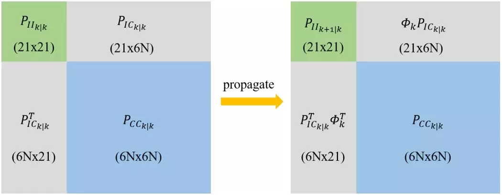

**预测角度**

角速度->角度 ref. <<Indirect Kalman Filter for 3D Attitude Estimation>> eq.122

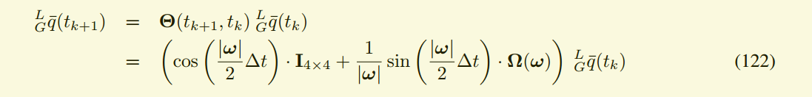

如果gyro很小需要使用另外一个公式：//TODO

关于四元数积分可以参考　[四元数积分](quaternion_integration.md)

代码：

```c++
  
  
  // Omega矩阵，四元数求导公式：  q' = 0.5 * Omega * q
  Matrix4d Omega = Matrix4d::Zero();
  Omega.block<3, 3>(0, 0) = -skewSymmetric(gyro);
  Omega.block<3, 1>(0, 3) = gyro;
  Omega.block<1, 3>(3, 0) = -gyro;
  
  // imu的当前状态
  Vector4d& q = state_server.imu_state.orientation;
  Vector3d& v = state_server.imu_state.velocity;
  Vector3d& p = state_server.imu_state.position;
  
  // 求角度:　采用四元数的零阶积分 ref. <<Indirect Kalman Filter for 3D Attitude Estimation>> eq.122
  double gyro_norm = gyro.norm();
  //dq_dt为更新一次后的四元数，dq_dt2为1/2△t时刻的四元数
  Vector4d dq_dt, dq_dt2;
  if (gyro_norm > 1e-5) {
    dq_dt = (cos(gyro_norm*dt*0.5)*Matrix4d::Identity() +
      1/gyro_norm*sin(gyro_norm*dt*0.5)*Omega) * q;
    dq_dt2 = (cos(gyro_norm*dt*0.25)*Matrix4d::Identity() +
      1/gyro_norm*sin(gyro_norm*dt*0.25)*Omega) * q;
  }
  else {
    // solve the numerical instability for very small w,　
    dq_dt = (Matrix4d::Identity()+0.5*dt*Omega) *
      cos(gyro_norm*dt*0.5) * q;
    dq_dt2 = (Matrix4d::Identity()+0.25*dt*Omega) *
      cos(gyro_norm*dt*0.25) * q;
  }
  
  Matrix3d dR_dt_transpose = quaternionToRotation(dq_dt).transpose();
  Matrix3d dR_dt2_transpose = quaternionToRotation(dq_dt2).transpose();
  Matrix3d dR_dt0_transpose = quaternionToRotation(q).transpose()
  // do P V integration 
      // 这部分代码见下一小节
  
  //    
  q = dq_dt;
  quaternionNormalize(q);
```


**预测速度/位置**

加速度->速度/位置　Runge-Kutta numerical integration methods ref <<Quaternion kinematics for the error-state Kalman filter>> Ａppendix A 

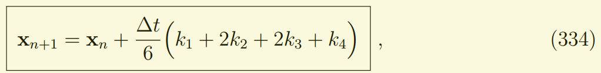

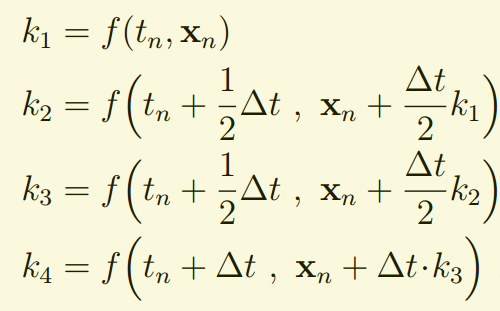

详细参考　[RK4积分笔记](RK4.md)

代码：

```c++
  // 求速度/位置
　// 龙哥库塔四个系数，tn表示当前时刻
  // 速度： k1 = f(tn, yn) = R(tn)*a+g  //todo需要补充
  // 位置： k1 = f(tn, pn) = v
  //dR_dt0_transpose acc由ＩＭＵ系变换到惯性系和重力一起的合力才是速度的微分
  Vector3d k1_v_dot = dR_dt0_transpose*acc + IMUState::gravity;　
  Vector3d k1_p_dot = v;

  // k2 = f(tn+dt/2, yn+k1*dt/2) 表示dt/2时刻，状态恒定为yn+k1*dt/2
  Vector3d k2_v_dot = dR_dt2_transpose*acc + IMUState::gravity;
  Vector3d k2_p_dot = v + k1_v_dot*dt/2;

  // k3 = f(tn+dt/2, yn+k2*dt/2)  表示dt/2时刻，状态恒定为yn+k2*dt/2
  Vector3d k3_v_dot = dR_dt2_transpose*acc + IMUState::gravity;
  Vector3d k3_p_dot = v + k2_v_dot*dt/2;

  // k4 = f(tn+dt, yn+k3*dt)  表示dt时刻，状态恒定为yn+k3*dt
  Vector3d k4_v_dot = dR_dt_transpose*acc + IMUState::gravity;
  Vector3d k4_p_dot = v + k3_v_dot*dt;

  // yn+1 = yn + dt/6*(k1+2*k2+2*k3+k4)
  v = v + dt/6*(k1_v_dot+2*k2_v_dot+2*k3_v_dot+k4_v_dot);
  p = p + dt/6*(k1_p_dot+2*k2_p_dot+2*k3_p_dot+k4_p_dot);
```


**预测误差状态中所有IMU相关的协方差** 

对IMU的协方差进行预测， 顺便更新$P_{IC}​$

参考s-msckf论文《Robust Stereo Visual Inertial Odometry for Fast Autonomous Flight》

- $\mathbf{P}_{k | k}=\left( \begin{array}{cc}{\mathbf{P}_{I I_{k|k}}} & {\mathbf{P}_{I C_{k|k}}} \\ {\mathbf{P}_{I C_{k|k}}^{\top}} & {\mathbf{P}_{C C_{k | k}}}\end{array}\right)​$ -> $\mathbf{P}_{k+1 | k}=\left( \begin{array}{cc}{\Phi_{k} \mathbf{P}_{I I_{k | k}} \Phi_{k}^{\top}+\mathbf{Q}_{k}} & {\Phi_{k} \mathbf{P}_{I C_{k|k}}} \\ {\mathbf{P}_{I C_{k|k}}^{\top} \Phi_{k}^{\top}} & {\mathbf{P}_{C C_{k | k}}}\end{array}\right)​$ 
- $\mathbf{P}_{I I_{k+1|k}}=\Phi_{k} \mathbf{P}_{I I_{k | k}} \Phi_{k}^{\top}+\mathbf{Q}_{k}$   
  - $\mathbf{\Phi}_{k}=\boldsymbol{\Phi}\left(t_{k+1}, t_{k}\right)=\exp \left(\int_{t_{k}}^{t_{k+1}} \mathbf{F}(\tau) d \tau\right)$    =  I + F *△t + 0.5*F^2*△t^2 + 1/6*F^3*△t^3....  还要考虑约束一致性对$\Phi_{11} \Phi_{31} \Phi_{51}$进行修正 

    

  - $\mathbf{Q}_{k}=\int_{t_{k}}^{t_{k+1}} \Phi\left(t_{k+1}, \tau\right) \operatorname{GQG} \Phi\left(t_{k+1}, \tau\right)^{\top} d \tau \approx $   $\mathbf{Q}=\mathbb{E}\left[\mathbf{n}_{I} \mathbf{n}_{I}^{\top}\right]$   $\mathbf{n}_{I}^{\top}=\left(\mathbf{n}_{g}^{\top} \mathbf{n}_{w g}^{\top} \mathbf{n}_{a}^{\top} \mathbf{n}_{w a}^{\top}\right)^{\top}$ 

$$
F = 
\begin{pmatrix}
-\left\lfloor\hat{\omega}_{x}\right\rfloor & -\mathbf{I}_3 & \mathbf{0}_3 & \mathbf{0}_3 & \mathbf{0}_3 & \mathbf{0}_3 & \mathbf{0}_3 \\ 
\mathbf{0}_3 & \mathbf{0}_3 & \mathbf{0}_3 & \mathbf{0}_3 & \mathbf{0}_3 & \mathbf{0}_3 &　\mathbf{0}_3 \\
-C\left(_{G}^{I} \hat{\mathbf{q}}\right)^{\top}\left\lfloor\hat{\mathbf{a}}_{ \times}\right\rfloor & \mathbf{0}_3 & \mathbf{0}_3 & -C\left(^I_G\hat{\mathbf{q}}\right)^{\top} & \mathbf{0}_3 & \mathbf{0}_3 & \mathbf{0}_3 \\
\mathbf{0}_3 & \mathbf{0}_3 & \mathbf{0}_3 & \mathbf{0}_3 & \mathbf{0}_3 & \mathbf{0}_3 &　\mathbf{0}_3 \\ 
\mathbf{0}_3 & \mathbf{0}_3 & \mathbf{I}_3 & \mathbf{0}_3 & \mathbf{0}_3 & \mathbf{0}_3 &　\mathbf{0}_3 \\ 
\mathbf{0}_3 & \mathbf{0}_3 & \mathbf{0}_3 & \mathbf{0}_3 & \mathbf{0}_3 & \mathbf{0}_3 &　\mathbf{0}_3 \\ 
\mathbf{0}_3 & \mathbf{0}_3 & \mathbf{0}_3 & \mathbf{0}_3 & \mathbf{0}_3 & \mathbf{0}_3 &　\mathbf{0}_3 \\ 
\end{pmatrix}

\\

F\Delta{t} = 
\begin{pmatrix}
-\left\lfloor\hat{\omega}_{x}\right\rfloor\Delta{t} & -\mathbf{I}_3\Delta{t} & \mathbf{0}_3 & \mathbf{0}_3 & \mathbf{0}_3 & \mathbf{0}_3 & \mathbf{0}_3 \\ 
\mathbf{0}_3 & \mathbf{0}_3 & \mathbf{0}_3 & \mathbf{0}_3 & \mathbf{0}_3 & \mathbf{0}_3 &　\mathbf{0}_3 \\
-C\left(_{G}^{I} \hat{\mathbf{q}}\right)^{\top}\left\lfloor\hat{\mathbf{a}}_{ \times}\right\rfloor\Delta{t} & \mathbf{0}_3 & \mathbf{0}_3 & -C\left(^I_G\hat{\mathbf{q}}\right)^{\top}\Delta{t} & \mathbf{0}_3 & \mathbf{0}_3 & \mathbf{0}_3 \\
\mathbf{0}_3 & \mathbf{0}_3 & \mathbf{0}_3 & \mathbf{0}_3 & \mathbf{0}_3 & \mathbf{0}_3 &　\mathbf{0}_3 \\ 
\mathbf{0}_3 & \mathbf{0}_3 & \mathbf{I}_3\Delta{t} & \mathbf{0}_3 & \mathbf{0}_3 & \mathbf{0}_3 &　\mathbf{0}_3 \\ 
\mathbf{0}_3 & \mathbf{0}_3 & \mathbf{0}_3 & \mathbf{0}_3 & \mathbf{0}_3 & \mathbf{0}_3 &　\mathbf{0}_3 \\ 
\mathbf{0}_3 & \mathbf{0}_3 & \mathbf{0}_3 & \mathbf{0}_3 & \mathbf{0}_3 & \mathbf{0}_3 &　\mathbf{0}_3 \\ 
\end{pmatrix}
$$


$$
\\

(F\Delta{t})^2 = 
\begin{pmatrix}
-\left\lfloor\hat{\omega}_{x}\right\rfloor\Delta{t} & -\mathbf{I}_3\Delta{t} & \mathbf{0}_3 & \mathbf{0}_3 & \mathbf{0}_3 & \mathbf{0}_3 & \mathbf{0}_3 \\ 
\mathbf{0}_3 & \mathbf{0}_3 & \mathbf{0}_3 & \mathbf{0}_3 & \mathbf{0}_3 & \mathbf{0}_3 &　\mathbf{0}_3 \\
-C\left(_{G}^{I} \hat{\mathbf{q}}\right)^{\top}\left\lfloor\hat{\mathbf{a}}_{ \times}\right\rfloor\Delta{t} & \mathbf{0}_3 & \mathbf{0}_3 & -C\left(^I_G\hat{\mathbf{q}}\right)^{\top}\Delta{t} & \mathbf{0}_3 & \mathbf{0}_3 & \mathbf{0}_3 \\
\mathbf{0}_3 & \mathbf{0}_3 & \mathbf{0}_3 & \mathbf{0}_3 & \mathbf{0}_3 & \mathbf{0}_3 &　\mathbf{0}_3 \\ 
\mathbf{0}_3 & \mathbf{0}_3 & \mathbf{I}_3\Delta{t} & \mathbf{0}_3 & \mathbf{0}_3 & \mathbf{0}_3 &　\mathbf{0}_3 \\ 
\mathbf{0}_3 & \mathbf{0}_3 & \mathbf{0}_3 & \mathbf{0}_3 & \mathbf{0}_3 & \mathbf{0}_3 &　\mathbf{0}_3 \\ 
\mathbf{0}_3 & \mathbf{0}_3 & \mathbf{0}_3 & \mathbf{0}_3 & \mathbf{0}_3 & \mathbf{0}_3 &　\mathbf{0}_3 \\ 
\end{pmatrix} 
\begin{pmatrix}
-\left\lfloor\hat{\omega}_{x}\right\rfloor\Delta{t} & -\mathbf{I}_3\Delta{t} & \mathbf{0}_3 & \mathbf{0}_3 & \mathbf{0}_3 & \mathbf{0}_3 & \mathbf{0}_3 \\ 
\mathbf{0}_3 & \mathbf{0}_3 & \mathbf{0}_3 & \mathbf{0}_3 & \mathbf{0}_3 & \mathbf{0}_3 &　\mathbf{0}_3 \\
-C\left(_{G}^{I} \hat{\mathbf{q}}\right)^{\top}\left\lfloor\hat{\mathbf{a}}_{ \times}\right\rfloor\Delta{t} & \mathbf{0}_3 & \mathbf{0}_3 & -C\left(^I_G\hat{\mathbf{q}}\right)^{\top}\Delta{t} & \mathbf{0}_3 & \mathbf{0}_3 & \mathbf{0}_3 \\
\mathbf{0}_3 & \mathbf{0}_3 & \mathbf{0}_3 & \mathbf{0}_3 & \mathbf{0}_3 & \mathbf{0}_3 &　\mathbf{0}_3 \\ 
\mathbf{0}_3 & \mathbf{0}_3 & \mathbf{I}_3\Delta{t} & \mathbf{0}_3 & \mathbf{0}_3 & \mathbf{0}_3 &　\mathbf{0}_3 \\ 
\mathbf{0}_3 & \mathbf{0}_3 & \mathbf{0}_3 & \mathbf{0}_3 & \mathbf{0}_3 & \mathbf{0}_3 &　\mathbf{0}_3 \\ 
\mathbf{0}_3 & \mathbf{0}_3 & \mathbf{0}_3 & \mathbf{0}_3 & \mathbf{0}_3 & \mathbf{0}_3 &　\mathbf{0}_3 \\ 
\end{pmatrix} \\
= 
\begin{pmatrix}
\left\lfloor\hat{\omega}_{x}\right\rfloor\Delta{t}\left\lfloor\hat{\omega}_{x}\right\rfloor\Delta{t} & \left\lfloor\hat{\omega}_{x}\right\rfloor\Delta{t}\Delta{t} & \mathbf{0}_3 & \mathbf{0}_3 & \mathbf{0}_3 & \mathbf{0}_3 & \mathbf{0}_3 \\ 
\mathbf{0}_3 & \mathbf{0}_3 & \mathbf{0}_3 & \mathbf{0}_3 & \mathbf{0}_3 & \mathbf{0}_3 &　\mathbf{0}_3 \\
C\left(_{G}^{I} \hat{\mathbf{q}}\right)^{\top}\left\lfloor\hat{\mathbf{a}}_{ \times}\right\rfloor\Delta{t}\left\lfloor\hat{\omega}_{x}\right\rfloor\Delta{t} & C\left(_{G}^{I} \hat{\mathbf{q}}\right)^{\top}\left\lfloor\hat{\mathbf{a}}_{ \times}\right\rfloor\Delta{t}\Delta{t} & \mathbf{0}_3 & \mathbf{0}_3 & \mathbf{0}_3 & \mathbf{0}_3 & \mathbf{0}_3 \\
\mathbf{0}_3 & \mathbf{0}_3 & \mathbf{0}_3 & \mathbf{0}_3 & \mathbf{0}_3 & \mathbf{0}_3 &　\mathbf{0}_3 \\ 
-C\left(_{G}^{I} \hat{\mathbf{q}}\right)^{\top}\left\lfloor\hat{\mathbf{a}}_{ \times}\right\rfloor\Delta{t}\Delta{t} & \mathbf{0}_3 & \mathbf{0}_3 & -C\left(^I_G\hat{\mathbf{q}}\right)^{\top}\Delta{t}\Delta{t} & \mathbf{0}_3 & \mathbf{0}_3 &　\mathbf{0}_3 \\ 
\mathbf{0}_3 & \mathbf{0}_3 & \mathbf{0}_3 & \mathbf{0}_3 & \mathbf{0}_3 & \mathbf{0}_3 &　\mathbf{0}_3 \\ 
\mathbf{0}_3 & \mathbf{0}_3 & \mathbf{0}_3 & \mathbf{0}_3 & \mathbf{0}_3 & \mathbf{0}_3 &　\mathbf{0}_3 \\ 
\end{pmatrix}
$$


$$
(F\Delta{t})^3 = 
\begin{pmatrix}
\left\lfloor\hat{\omega}_{x}\right\rfloor\Delta{t}\left\lfloor\hat{\omega}_{x}\right\rfloor\Delta{t} & \left\lfloor\hat{\omega}_{x}\right\rfloor\Delta{t}\Delta{t} & \mathbf{0}_3 & \mathbf{0}_3 & \mathbf{0}_3 & \mathbf{0}_3 & \mathbf{0}_3 \\ 
\mathbf{0}_3 & \mathbf{0}_3 & \mathbf{0}_3 & \mathbf{0}_3 & \mathbf{0}_3 & \mathbf{0}_3 &　\mathbf{0}_3 \\ 
C\left(_{G}^{I} \hat{\mathbf{q}}\right)^{\top}\left\lfloor\hat{\mathbf{a}}_{ \times}\right\rfloor\Delta{t}\left\lfloor\hat{\omega}_{x}\right\rfloor\Delta{t} & C\left(_{G}^{I} \hat{\mathbf{q}}\right)^{\top}\left\lfloor\hat{\mathbf{a}}_{ \times}\right\rfloor\Delta{t}\Delta{t} & \mathbf{0}_3 & \mathbf{0}_3 & \mathbf{0}_3 & \mathbf{0}_3 & \mathbf{0}_3 \\ 
\mathbf{0}_3 & \mathbf{0}_3 & \mathbf{0}_3 & \mathbf{0}_3 & \mathbf{0}_3 & \mathbf{0}_3 &　\mathbf{0}_3 \\ 
-C\left(_{G}^{I} \hat{\mathbf{q}}\right)^{\top}\left\lfloor\hat{\mathbf{a}}_{ \times}\right\rfloor\Delta{t}\Delta{t} & \mathbf{0}_3 & \mathbf{0}_3 & -C\left(^I_G\hat{\mathbf{q}}\right)^{\top}\Delta{t}\Delta{t} & \mathbf{0}_3 & \mathbf{0}_3 &　\mathbf{0}_3 \\ 
\mathbf{0}_3 & \mathbf{0}_3 & \mathbf{0}_3 & \mathbf{0}_3 & \mathbf{0}_3 & \mathbf{0}_3 &　\mathbf{0}_3 \\ 
\mathbf{0}_3 & \mathbf{0}_3 & \mathbf{0}_3 & \mathbf{0}_3 & \mathbf{0}_3 & \mathbf{0}_3 &　\mathbf{0}_3 \\
\end{pmatrix}

\begin{pmatrix}
-\left\lfloor\hat{\omega}_{x}\right\rfloor\Delta{t} & -\mathbf{I}_3\Delta{t} & \mathbf{0}_3 & \mathbf{0}_3 & \mathbf{0}_3 & \mathbf{0}_3 & \mathbf{0}_3 \\ 
\mathbf{0}_3 & \mathbf{0}_3 & \mathbf{0}_3 & \mathbf{0}_3 & \mathbf{0}_3 & \mathbf{0}_3 &　\mathbf{0}_3 \\ 
-C\left(_{G}^{I} \hat{\mathbf{q}}\right)^{\top}\left\lfloor\hat{\mathbf{a}}_{ \times}\right\rfloor\Delta{t} & \mathbf{0}_3 & \mathbf{0}_3 & -C\left(^I_G\hat{\mathbf{q}}\right)^{\top}\Delta{t} & \mathbf{0}_3 & \mathbf{0}_3 & \mathbf{0}_3 \\ 
\mathbf{0}_3 & \mathbf{0}_3 & \mathbf{0}_3 & \mathbf{0}_3 & \mathbf{0}_3 & \mathbf{0}_3 &　\mathbf{0}_3 \\ 
\mathbf{0}_3 & \mathbf{0}_3 & \mathbf{I}_3\Delta{t} & \mathbf{0}_3 & \mathbf{0}_3 & \mathbf{0}_3 &　\mathbf{0}_3 \\ 
\mathbf{0}_3 & \mathbf{0}_3 & \mathbf{0}_3 & \mathbf{0}_3 & \mathbf{0}_3 & \mathbf{0}_3 &　\mathbf{0}_3 \\ 
\mathbf{0}_3 & \mathbf{0}_3 & \mathbf{0}_3 & \mathbf{0}_3 & \mathbf{0}_3 & \mathbf{0}_3 &　\mathbf{0}_3 \\ 
\end{pmatrix} 

\\= 
\begin{pmatrix}
-\left\lfloor\hat{\omega}_{x}\right\rfloor\Delta{t}\left\lfloor\hat{\omega}_{x}\right\rfloor\Delta{t}\left\lfloor\hat{\omega}_{x}\right\rfloor\Delta{t} & -\left\lfloor\hat{\omega}_{x}\right\rfloor\Delta{t}\left\lfloor\hat{\omega}_{x}\right\rfloor\Delta{t}\Delta{t} & \mathbf{0}_3 & \mathbf{0}_3 & \mathbf{0}_3 & \mathbf{0}_3 & \mathbf{0}_3 \\ 
\mathbf{0}_3 & \mathbf{0}_3 & \mathbf{0}_3 & \mathbf{0}_3 & \mathbf{0}_3 & \mathbf{0}_3 &　\mathbf{0}_3 \\ 
-C\left(_{G}^{I} \hat{\mathbf{q}}\right)^{\top}\left\lfloor\hat{\mathbf{a}}_{ \times}\right\rfloor\Delta{t}\left\lfloor\hat{\omega}_{x}\right\rfloor\Delta{t}\left\lfloor\hat{\omega}_{x}\right\rfloor\Delta{t} & -C\left(_{G}^{I} \hat{\mathbf{q}}\right)^{\top}\left\lfloor\hat{\mathbf{a}}_{ \times}\right\rfloor\Delta{t}\left\lfloor\hat{\omega}_{x}\right\rfloor\Delta{t}\Delta{t} & \mathbf{0}_3 & \mathbf{0}_3 & \mathbf{0}_3 & \mathbf{0}_3 & \mathbf{0}_3 \\ 
\mathbf{0}_3 & \mathbf{0}_3 & \mathbf{0}_3 & \mathbf{0}_3 & \mathbf{0}_3 & \mathbf{0}_3 &　\mathbf{0}_3 \\ 
C\left(_{G}^{I} \hat{\mathbf{q}}\right)^{\top}\left\lfloor\hat{\mathbf{a}}_{ \times}\right\rfloor\Delta{t}\Delta{t}\left\lfloor\hat{\omega}_{x}\right\rfloor\Delta{t} & C\left(_{G}^{I} \hat{\mathbf{q}}\right)^{\top}\left\lfloor\hat{\mathbf{a}}_{ \times}\right\rfloor\Delta{t}\Delta{t}\Delta{t} & \mathbf{0}_3 & \mathbf{0}_3 & \mathbf{0}_3 & \mathbf{0}_3 &　\mathbf{0}_3 \\ 
\mathbf{0}_3 & \mathbf{0}_3 & \mathbf{0}_3 & \mathbf{0}_3 & \mathbf{0}_3 & \mathbf{0}_3 &　\mathbf{0}_3 \\ 
\mathbf{0}_3 & \mathbf{0}_3 & \mathbf{0}_3 & \mathbf{0}_3 & \mathbf{0}_3 & \mathbf{0}_3 &　\mathbf{0}_3 \\ 
\end{pmatrix}
$$

$$
\Phi = \mathbf{I} + \mathbf{F}\Delta{t}+\frac{1}{2}(\mathbf{F}\Delta{t})^2+\frac{1}{6}(\mathbf{F}\Delta{t})^3 
=
\begin{pmatrix}
\mathbf{I}_3 & \mathbf{0}_3 & \mathbf{0}_3 & \mathbf{0}_3 & \mathbf{0}_3 & \mathbf{0}_3 & \mathbf{0}_3 \\ 
\mathbf{0}_3 & \mathbf{I}_3 & \mathbf{0}_3 & \mathbf{0}_3 & \mathbf{0}_3 & \mathbf{0}_3 &　\mathbf{0}_3 \\
\mathbf{0}_3 & \mathbf{0}_3 & \mathbf{I}_3 & \mathbf{0}_3 & \mathbf{0}_3 & \mathbf{0}_3 &　\mathbf{0}_3 \\
\mathbf{0}_3 & \mathbf{0}_3 & \mathbf{0}_3 & \mathbf{I}_3 & \mathbf{0}_3 & \mathbf{0}_3 &　\mathbf{0}_3 \\
\mathbf{0}_3 & \mathbf{0}_3 & \mathbf{0}_3 & \mathbf{0}_3 & \mathbf{I}_3 & \mathbf{0}_3 &　\mathbf{0}_3 \\
\mathbf{0}_3 & \mathbf{0}_3 & \mathbf{0}_3 & \mathbf{0}_3 & \mathbf{0}_3 & \mathbf{I}_3 &　\mathbf{0}_3 \\ 
\mathbf{0}_3 & \mathbf{0}_3 & \mathbf{0}_3 & \mathbf{0}_3 & \mathbf{0}_3 & \mathbf{0}_3 &　\mathbf{I}_3 \\ 
\end{pmatrix}

+ \begin{pmatrix}
-\left\lfloor\hat{\omega}_{x}\right\rfloor\Delta{t} & -\mathbf{I}_3\Delta{t} & \mathbf{0}_3 & \mathbf{0}_3 & \mathbf{0}_3 & \mathbf{0}_3 & \mathbf{0}_3 \\ 
\mathbf{0}_3 & \mathbf{0}_3 & \mathbf{0}_3 & \mathbf{0}_3 & \mathbf{0}_3 & \mathbf{0}_3 &　\mathbf{0}_3 \\
-C\left(_{G}^{I} \hat{\mathbf{q}}\right)^{\top}\left\lfloor\hat{\mathbf{a}}_{ \times}\right\rfloor\Delta{t} & \mathbf{0}_3 & \mathbf{0}_3 & -C\left(^I_G\hat{\mathbf{q}}\right)^{\top}\Delta{t} & \mathbf{0}_3 & \mathbf{0}_3 & \mathbf{0}_3 \\
\mathbf{0}_3 & \mathbf{0}_3 & \mathbf{0}_3 & \mathbf{0}_3 & \mathbf{0}_3 & \mathbf{0}_3 &　\mathbf{0}_3 \\ 
\mathbf{0}_3 & \mathbf{0}_3 & \mathbf{I}_3\Delta{t} & \mathbf{0}_3 & \mathbf{0}_3 & \mathbf{0}_3 &　\mathbf{0}_3 \\ 
\mathbf{0}_3 & \mathbf{0}_3 & \mathbf{0}_3 & \mathbf{0}_3 & \mathbf{0}_3 & \mathbf{0}_3 &　\mathbf{0}_3 \\ 
\mathbf{0}_3 & \mathbf{0}_3 & \mathbf{0}_3 & \mathbf{0}_3 & \mathbf{0}_3 & \mathbf{0}_3 &　\mathbf{0}_3 \\ 
\end{pmatrix}

+ \frac{1}{2} \begin{pmatrix}
\left\lfloor\hat{\omega}_{x}\right\rfloor\Delta{t}\left\lfloor\hat{\omega}_{x}\right\rfloor\Delta{t} & \left\lfloor\hat{\omega}_{x}\right\rfloor\Delta{t}\Delta{t} & \mathbf{0}_3 & \mathbf{0}_3 & \mathbf{0}_3 & \mathbf{0}_3 & \mathbf{0}_3 \\ 
\mathbf{0}_3 & \mathbf{0}_3 & \mathbf{0}_3 & \mathbf{0}_3 & \mathbf{0}_3 & \mathbf{0}_3 &　\mathbf{0}_3 \\
C\left(_{G}^{I} \hat{\mathbf{q}}\right)^{\top}\left\lfloor\hat{\mathbf{a}}_{ \times}\right\rfloor\Delta{t}\left\lfloor\hat{\omega}_{x}\right\rfloor\Delta{t} & C\left(_{G}^{I} \hat{\mathbf{q}}\right)^{\top}\left\lfloor\hat{\mathbf{a}}_{ \times}\right\rfloor\Delta{t}\Delta{t} & \mathbf{0}_3 & \mathbf{0}_3 & \mathbf{0}_3 & \mathbf{0}_3 & \mathbf{0}_3 \\
\mathbf{0}_3 & \mathbf{0}_3 & \mathbf{0}_3 & \mathbf{0}_3 & \mathbf{0}_3 & \mathbf{0}_3 &　\mathbf{0}_3 \\ 
-C\left(_{G}^{I} \hat{\mathbf{q}}\right)^{\top}\left\lfloor\hat{\mathbf{a}}_{ \times}\right\rfloor\Delta{t}\Delta{t} & \mathbf{0}_3 & \mathbf{0}_3 & -C\left(^I_G\hat{\mathbf{q}}\right)^{\top}\Delta{t}\Delta{t} & \mathbf{0}_3 & \mathbf{0}_3 &　\mathbf{0}_3 \\ 
\mathbf{0}_3 & \mathbf{0}_3 & \mathbf{0}_3 & \mathbf{0}_3 & \mathbf{0}_3 & \mathbf{0}_3 &　\mathbf{0}_3 \\ 
\mathbf{0}_3 & \mathbf{0}_3 & \mathbf{0}_3 & \mathbf{0}_3 & \mathbf{0}_3 & \mathbf{0}_3 &　\mathbf{0}_3 \\ 
\end{pmatrix}

+\frac{1}{6} \begin{pmatrix}
-\left\lfloor\hat{\omega}_{x}\right\rfloor\Delta{t}\left\lfloor\hat{\omega}_{x}\right\rfloor\Delta{t}\left\lfloor\hat{\omega}_{x}\right\rfloor\Delta{t} & -\left\lfloor\hat{\omega}_{x}\right\rfloor\Delta{t}\left\lfloor\hat{\omega}_{x}\right\rfloor\Delta{t}\Delta{t} & \mathbf{0}_3 & \mathbf{0}_3 & \mathbf{0}_3 & \mathbf{0}_3 & \mathbf{0}_3 \\ 
\mathbf{0}_3 & \mathbf{0}_3 & \mathbf{0}_3 & \mathbf{0}_3 & \mathbf{0}_3 & \mathbf{0}_3 &　\mathbf{0}_3 \\ 
-C\left(_{G}^{I} \hat{\mathbf{q}}\right)^{\top}\left\lfloor\hat{\mathbf{a}}_{ \times}\right\rfloor\Delta{t}\left\lfloor\hat{\omega}_{x}\right\rfloor\Delta{t}\left\lfloor\hat{\omega}_{x}\right\rfloor\Delta{t} & -C\left(_{G}^{I} \hat{\mathbf{q}}\right)^{\top}\left\lfloor\hat{\mathbf{a}}_{ \times}\right\rfloor\Delta{t}\left\lfloor\hat{\omega}_{x}\right\rfloor\Delta{t}\Delta{t} & \mathbf{0}_3 & \mathbf{0}_3 & \mathbf{0}_3 & \mathbf{0}_3 & \mathbf{0}_3 \\ 
\mathbf{0}_3 & \mathbf{0}_3 & \mathbf{0}_3 & \mathbf{0}_3 & \mathbf{0}_3 & \mathbf{0}_3 &　\mathbf{0}_3 \\ 
C\left(_{G}^{I} \hat{\mathbf{q}}\right)^{\top}\left\lfloor\hat{\mathbf{a}}_{ \times}\right\rfloor\Delta{t}\Delta{t}\left\lfloor\hat{\omega}_{x}\right\rfloor\Delta{t} & C\left(_{G}^{I} \hat{\mathbf{q}}\right)^{\top}\left\lfloor\hat{\mathbf{a}}_{ \times}\right\rfloor\Delta{t}\Delta{t}\Delta{t} & \mathbf{0}_3 & \mathbf{0}_3 & \mathbf{0}_3 & \mathbf{0}_3 &　\mathbf{0}_3 \\ 
\mathbf{0}_3 & \mathbf{0}_3 & \mathbf{0}_3 & \mathbf{0}_3 & \mathbf{0}_3 & \mathbf{0}_3 &　\mathbf{0}_3 \\ 
\mathbf{0}_3 & \mathbf{0}_3 & \mathbf{0}_3 & \mathbf{0}_3 & \mathbf{0}_3 & \mathbf{0}_3 &　\mathbf{0}_3 \\ 
\end{pmatrix}
$$

$$
\\ 
= \begin{pmatrix}
\mathbf{I}_3-\left\lfloor\hat{\omega}_{x}\right\rfloor\Delta{t}+\frac{1}{2}\left\lfloor\hat{\omega}_{x}\right\rfloor\Delta{t}\left\lfloor\hat{\omega}_{x}\right\rfloor\Delta{t} -\frac{1}{6}\left\lfloor\hat{\omega}_{x}\right\rfloor\Delta{t}\left\lfloor\hat{\omega}_{x}\right\rfloor\Delta{t}\left\lfloor\hat{\omega}_{x}\right\rfloor\Delta{t} & -\mathbf{I}_3\Delta{t} + \frac{1}{2}\left\lfloor\hat{\omega}_{x}\right\rfloor\Delta{t}\Delta{t} - \frac{1}{6}\left\lfloor\hat{\omega}_{x}\right\rfloor\Delta{t}\left\lfloor\hat{\omega}_{x}\right\rfloor\Delta{t}\Delta{t} & \mathbf{0}_3 & \mathbf{0}_3 & \mathbf{0}_3 & \mathbf{0}_3 & \mathbf{0}_3 \\ 
\mathbf{0}_3 & \mathbf{I}_3 & \mathbf{0}_3 & \mathbf{0}_3 & \mathbf{0}_3 & \mathbf{0}_3 &　\mathbf{0}_3 \\
-C\left(_{G}^{I} \hat{\mathbf{q}}\right)^{\top}\left\lfloor\hat{\mathbf{a}}_{ \times}\right\rfloor\Delta{t} + \frac{1}{2}C\left(_{G}^{I} \hat{\mathbf{q}}\right)^{\top}\left\lfloor\hat{\mathbf{a}}_{ \times}\right\rfloor\Delta{t}\left\lfloor\hat{\omega}_{x}\right\rfloor\Delta{t} -\frac{1}{6}C\left(_{G}^{I} \hat{\mathbf{q}}\right)^{\top}\left\lfloor\hat{\mathbf{a}}_{ \times}\right\rfloor\Delta{t}\left\lfloor\hat{\omega}_{x}\right\rfloor\Delta{t}\left\lfloor\hat{\omega}_{x}\right\rfloor\Delta{t} & \frac{1}{2}C\left(_{G}^{I} \hat{\mathbf{q}}\right)^{\top}\left\lfloor\hat{\mathbf{a}}_{ \times}\right\rfloor\Delta{t}\Delta{t} - \frac{1}{6}C\left(_{G}^{I} \hat{\mathbf{q}}\right)^{\top}\left\lfloor\hat{\mathbf{a}}_{ \times}\right\rfloor\Delta{t}\left\lfloor\hat{\omega}_{x}\right\rfloor\Delta{t}\Delta{t} & \mathbf{I}_3 & -C\left(^I_G\hat{\mathbf{q}}\right)^{\top}\Delta{t} & \mathbf{0}_3 & \mathbf{0}_3 &　\mathbf{0}_3 \\
\mathbf{0}_3 & \mathbf{0}_3 & \mathbf{0}_3 & \mathbf{I}_3 & \mathbf{0}_3 & \mathbf{0}_3 &　\mathbf{0}_3 \\
-\frac{1}{2}C\left(_{G}^{I} \hat{\mathbf{q}}\right)^{\top}\left\lfloor\hat{\mathbf{a}}_{ \times}\right\rfloor\Delta{t}\Delta{t} 
+\frac{1}{6}C\left(_{G}^{I} \hat{\mathbf{q}}\right)^{\top}\left\lfloor\hat{\mathbf{a}}_{ \times}\right\rfloor\Delta{t}\Delta{t}\left\lfloor\hat{\omega}_{x}\right\rfloor\Delta{t} & +\frac{1}{6}C\left(_{G}^{I} \hat{\mathbf{q}}\right)^{\top}\left\lfloor\hat{\mathbf{a}}_{ \times}\right\rfloor\Delta{t}\Delta{t}\Delta{t} & \mathbf{I}_3\Delta{t} & -\frac{1}{2}C\left(^I_G\hat{\mathbf{q}}\right)^{\top}\Delta{t}\Delta{t}  & \mathbf{I}_3 & \mathbf{0}_3 &　\mathbf{0}_3 \\
\mathbf{0}_3 & \mathbf{0}_3 & \mathbf{0}_3 & \mathbf{0}_3 & \mathbf{0}_3 & \mathbf{I}_3 &　\mathbf{0}_3 \\ 
\mathbf{0}_3 & \mathbf{0}_3 & \mathbf{0}_3 & \mathbf{0}_3 & \mathbf{0}_3 & \mathbf{0}_3 &　\mathbf{I}_3 \\ 
\end{pmatrix}
$$


```c++
void MsckfVio::processModel(const double& time,
    const Vector3d& m_gyro,
    const Vector3d& m_acc) {

  // Remove the bias from the measured gyro and acceleration
  // 对Imu量测去掉偏置
  // 见论文III-A 公式(1)，式中的gyro为论文中的^ω，而acc为^a
  IMUState& imu_state = state_server.imu_state;
  Vector3d gyro = m_gyro - imu_state.gyro_bias;
  Vector3d acc = m_acc - imu_state.acc_bias;
  double dtime = time - imu_state.time;

  // Compute discrete transition and noise covariance matrix
  // 误差传递方程的两个矩阵: x‘= F * x + G * n
  Matrix<double, 21, 21> F = Matrix<double, 21, 21>::Zero();
  Matrix<double, 21, 12> G = Matrix<double, 21, 12>::Zero();

  // F矩阵的计算详见论文附录A
  // imu_state.orientation为（I_G）^q，即
  F.block<3, 3>(0, 0) = -skewSymmetric(gyro);
  F.block<3, 3>(0, 3) = -Matrix3d::Identity();
  F.block<3, 3>(6, 0) = -quaternionToRotation(
      imu_state.orientation).transpose()*skewSymmetric(acc);
  F.block<3, 3>(6, 9) = -quaternionToRotation(
      imu_state.orientation).transpose();
  F.block<3, 3>(12, 6) = Matrix3d::Identity();

  G.block<3, 3>(0, 0) = -Matrix3d::Identity();
  G.block<3, 3>(3, 3) = Matrix3d::Identity();
  G.block<3, 3>(6, 6) = -quaternionToRotation(
      imu_state.orientation).transpose();
  G.block<3, 3>(9, 9) = Matrix3d::Identity();

  // Approximate matrix exponential to the 3rd order,
  // which can be considered to be accurate enough assuming
  // dtime is within 0.01s.
  // F和G是连续时间下的误差方程，需要离散化
  // x‘= F * x + G * n离散化得到方程
  // x(k+1) = Φx(k) + W(k)
  // 离散化状态转移矩阵F得到的矩阵为Φ，计算详见组合导航44页
  // Φ等于e^(F*△t)
  // 将其泰勒展开，保留三阶项：Φ = I + F *△t + 0.5*F^2*△t^2 + 1/6*F^3*△t^3....
  Matrix<double, 21, 21> Fdt = F * dtime;
  Matrix<double, 21, 21> Fdt_square = Fdt * Fdt;
  Matrix<double, 21, 21> Fdt_cube = Fdt_square * Fdt;
  Matrix<double, 21, 21> Phi = Matrix<double, 21, 21>::Identity() +
    Fdt + 0.5*Fdt_square + (1.0/6.0)*Fdt_cube;

  // Propogate the state using 4th order Runge-Kutta
  // 采用4阶龙哥库塔数值积分来传递imu状态误差，得到预测的新状态值
  // Modified the q v p
  predictNewState(dtime, gyro, acc);

  // Modify the transition matrix
  // For observility constrain
  // OC-EKF: <<On the consistency of Vision-aided Inertial Navigation>> ref.1
  // <<Consistency Analysis and Improvement of Vision-aided Inertial Navigation>> ref.2
  Matrix3d R_kk_1 = quaternionToRotation(imu_state.orientation_null); /// R which take a vector from world to Imu I_R_G(k,k-1)
  // quaternionToRotation(imu_state.orientation) => I_R_G(k+1,k)
  Phi.block<3, 3>(0, 0) =
    quaternionToRotation(imu_state.orientation) * R_kk_1.transpose(); /// ref.1 equation 21.
  /// ref.1 equation (22)-(24)
  /// A* = A-(Au-w)s; s = (u.t * u)^-1 * u.t
  Vector3d u = R_kk_1 * IMUState::gravity;
  RowVector3d s = (u.transpose()*u).inverse() * u.transpose();

  Matrix3d A1 = Phi.block<3, 3>(6, 0);
  Vector3d w1 = skewSymmetric(
      imu_state.velocity_null-imu_state.velocity) * IMUState::gravity;
  Phi.block<3, 3>(6, 0) = A1 - (A1*u-w1)*s;

  Matrix3d A2 = Phi.block<3, 3>(12, 0);
  Vector3d w2 = skewSymmetric(
      dtime*imu_state.velocity_null+imu_state.position_null-
      imu_state.position) * IMUState::gravity;
  Phi.block<3, 3>(12, 0) = A2 - (A2*u-w2)*s;

  // Propogate the state covariance matrix.
  // Imu噪声协方差矩阵Q为state_server.continuous_noise_cov（动态系统 对应连续系统）
  // 连续时间下状态转移矩阵的噪声协方差阵： Qk = 积分（Φ G Q G^T Φ^T dt） (动态系统 对应连续系统）
  // 离散化噪声协方差: Qk = (Φ G Q G^T Φ^T) dt （状态转移方程 对应离散系统）
  // 卡尔曼滤波器的均方误差为 state_server.state_cov = Φ P Φ^T + Qk
  Matrix<double, 21, 21> Q = Phi*G*state_server.continuous_noise_cov*
    G.transpose()*Phi.transpose()*dtime;
  state_server.state_cov.block<21, 21>(0, 0) =
    Phi*state_server.state_cov.block<21, 21>(0, 0)*Phi.transpose() + Q;

  // MSCKF的协方差矩阵由四块组成：  imu状态的协方差矩阵块、相机位姿估计的协方差矩阵块、imu状态和相机位姿估计相关性的协方差
  //          [ P_I_I(k|k)      P_I_C(k|k)]
  // P_k_k  = [                           ]
  //          [ P_I_C(k|k).T    P_C_C(k|k)]
  // 协方差传递如下：
  //          [ P_I_I(k+1|k)    Φ * P_I_C(k|k)]
  // P_k_k  = [                           ]
  //          [ P_I_C(k|k).T * Φ.T  P_C_C(k|k)]
  if (state_server.cam_states.size() > 0) {
    //如果state中存在cam状态
    state_server.state_cov.block(
        0, 21, 21, state_server.state_cov.cols()-21) =
      Phi * state_server.state_cov.block(
        0, 21, 21, state_server.state_cov.cols()-21);
    state_server.state_cov.block(
        21, 0, state_server.state_cov.rows()-21, 21) =
      state_server.state_cov.block(
        21, 0, state_server.state_cov.rows()-21, 21) * Phi.transpose();
  }

  // 为了对称
  MatrixXd state_cov_fixed = (state_server.state_cov +
      state_server.state_cov.transpose()) / 2.0;
  state_server.state_cov = state_cov_fixed;

  // Update the state correspondes to null space.
  imu_state.orientation_null = imu_state.orientation;
  imu_state.position_null = imu_state.position;
  imu_state.velocity_null = imu_state.velocity;

  // Update the state info
  state_server.imu_state.time = time;
  return;
}
```


## 预测Camera状态

- 预测nominal-state中的Camera部分：其实就是新增一个$C_6$相关状态
- 预测error-state中的Camera部分：1) 误差状态的均值是0所以不用管，2) 预测误差状态中所有Camera相关的协方差

相机的预测其实就是 新增一个当前帧的相机位姿 到状态向量中，同时更新相应的协方差。


**新增相机状态**（nominal-state）

最新的相机状态可由最新IMU状态推导出来。 $C_{\hat{\mathbf{q}}}=_{I}^{C} \hat{\mathbf{q}} \otimes_{G}^{I} \hat{\mathbf{q}}$    $^{G} \hat{\mathbf{p}}_{C}=^{G} \hat{\mathbf{p}}_{C}+C\left(_{G}^{I} \hat{\mathbf{q}}\right)^{\top} \hat{\mathbf{p}}_{C}$ 

```c++
  const Matrix3d& R_i_c = state_server.imu_state.R_imu_cam0;
  const Vector3d& t_c_i = state_server.imu_state.t_cam0_imu;

  // 步骤1： Add a new camera state to the state server.
  // 根据imu与相机的外参以及imu自身的运动模型可以大致推断出当前相机的位姿
  // R_w_i表示，惯性系到imu系的转换； R_i_c表示imu到相机转换； R_w_c表示惯性系到相机转换
  // t_c_w表示惯性系下的相机位置； t_c_i表示imu系下的相机位置（外参的t）
  Matrix3d R_w_i = quaternionToRotation(
      state_server.imu_state.orientation);
  Matrix3d R_w_c = R_i_c * R_w_i;
  Vector3d t_c_w = state_server.imu_state.position +
    R_w_i.transpose()*t_c_i;
   // 为该新生成的相机状态创建新的结构体 
  // state_server.cam_states的类型pair<const StateIDType, CAMState> > >
  state_server.cam_states[state_server.imu_state.id] =
    CAMState(state_server.imu_state.id);
  CAMState& cam_state = state_server.cam_states[
    state_server.imu_state.id];

  // 保存imu估计得到的相机位姿信息
  cam_state.time = time;
  cam_state.orientation = rotationToQuaternion(R_w_c);
  cam_state.position = t_c_w;

  cam_state.orientation_null = cam_state.orientation;
  cam_state.position_null = cam_state.position;
```


**协方差增广**(error-state)

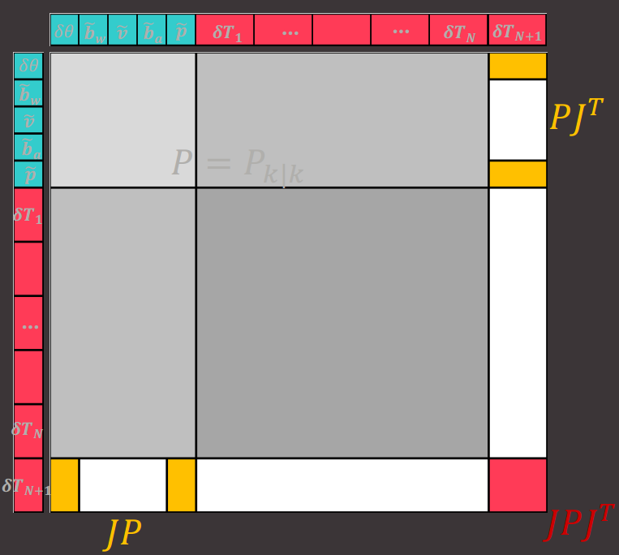


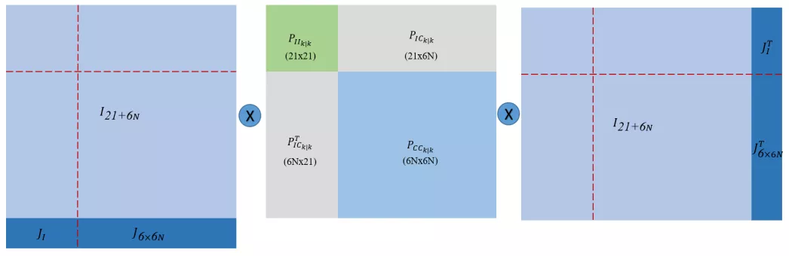


$\mathbf{P}_{k | k}=\left( \begin{array}{c}{\mathbf{I}_{21+6 N}} \\ {\mathbf{J}}\end{array}\right) \mathbf{P}_{k | k} \left( \begin{array}{c}{\mathbf{I}_{21+6 N}} \\ {\mathbf{J}}\end{array}\right)^{\top}​$      $\mathbf{J}=\left( \begin{array}{ll}{\mathbf{J}_{I}} & {\mathbf{0}_{6 \times 6 N}}\end{array}\right)​$      $\mathbf{J}_{I}=\left( \begin{array}{cccc}{C\left(_{G}^{I} \hat{\mathbf{q}}\right)} & {\mathbf{0}_{3 \times 9}} & {\mathbf{0}_{3 \times 3}} & {\mathbf{I}_{3}} & {\mathbf{0}_{3 \times 3}} \\ {-C\left(_{G}^{I} \hat{\mathbf{q}}\right)^{\top}\left\lfloor^{I} \hat{\mathbf{p}}_{C} \times\right\rfloor} & {\mathbf{0}_{3 \times 9}} & {\mathbf{I}_{3}} & {\mathbf{0}_{3 \times 3}} & {\mathbf{I}_{3}}\end{array}\right)​$ 

```c++
  // Update the covariance matrix of the state.
  // To simplify computation, the matrix J below is the nontrivial block
  // in Equation (16) in "A Multi-State Constraint Kalman Filter for Vision
  // -aided Inertial Navigation".
  // 步骤2： 增广相机状态后， 需要计算增广的相机状态对msckf已有的状态的雅克比
  // 雅克比的计算详见论文《s-msckf》文章的附录B
  Matrix<double, 6, 21> J = Matrix<double, 6, 21>::Zero();
  J.block<3, 3>(0, 0) = R_i_c; //todo wrong?
  J.block<3, 3>(0, 15) = Matrix3d::Identity();
//  J.block<3, 3>(3, 0) = skewSymmetric(R_w_i.transpose()*t_c_i);
  J.block<3, 3>(3, 0) = -R_w_i.transpose()*skewSymmetric(t_c_i);
  J.block<3, 3>(3, 12) = Matrix3d::Identity();
  J.block<3, 3>(3, 18) = R_w_i.transpose()*Matrix3d::Identity(); //todo wrong?

  // Resize the state covariance matrix.
  // msckf未增广状态矩阵前的协方差矩阵维数
  size_t old_rows = state_server.state_cov.rows();
  size_t old_cols = state_server.state_cov.cols();
  // 
  state_server.state_cov.conservativeResize(old_rows+6, old_cols+6);

  // Rename some matrix blocks for convenience.
  const Matrix<double, 21, 21>& P11 =
    state_server.state_cov.block<21, 21>(0, 0);
  const MatrixXd& P12 =
    state_server.state_cov.block(0, 21, 21, old_cols-21);

  // Fill in the augmented state covariance.
  // 协方差矩阵增广
  //      [ I(21+6N) ]          [ I(21+6N) ]^T
  //  P = [          ] P11 P12  [          ]
  //      [    J J0  ] P21 P22  [    J J0  ]
  //
  state_server.state_cov.block(old_rows, 0, 6, old_cols) << J*P11, J*P12;
  state_server.state_cov.block(0, old_cols, old_rows, 6) =
    state_server.state_cov.block(old_rows, 0, 6, old_cols).transpose();
  state_server.state_cov.block<6, 6>(old_rows, old_cols) =
    J * P11 * J.transpose();

  // Fix the covariance to be symmetric
  MatrixXd state_cov_fixed = (state_server.state_cov +
      state_server.state_cov.transpose()) / 2.0;
  state_server.state_cov = state_cov_fixed;
```


# 更新


- 筛选出待更新的视觉约束关系(即“特征点和对应的相机状态”)计算观测矩阵H , 其中removeLostFeatures是根据特征点来选， pruneCamStateBuffer是根据移除的相机状态来选  （所以这两种是否可以合并呢？ 更新完只有要删除部分特征点和部分相机状态及其协方差）
- 计算kalman增益K，计算误差状态的后验估计和协方差。对应函数为measurementUpdate
- 更新nominal-state并重置error-state


## 观测方程 


抽象的u观测方程
$$
\begin{align*}

\mathbf{z}_k &= h(\mathbf{x}_k) + \mathbf{v}_k \\&= h(\bar{\mathbf{x}}_k) + \frac{\partial h}{ \partial \mathbf{x}_k} \Bigr|_{\bar{x}_k}(\mathbf{x}_k-\bar{\mathbf{x}}_k) + \mathbf{v}_k \\&= h(\bar{\mathbf{x}}_k) + H(\mathbf{x}_k-\bar{\mathbf{x}}_k) + \mathbf{v}_k


\\\\

P(\mathbf{v_k}) &\sim N(\mathbf{0}, \mathbf{Q}_k) 

\\P(\mathbf{z}_k | \mathbf{x}_k) &\sim N(h(\bar{\mathbf{x}}_k)+H(\mathbf{x}_k-\bar{\mathbf{x}}_k) ,\mathbf{Q}_k)

\end{align*}
$$


具体的观测方程

- 特征点$f_j  = \  ^{G}\mathbf{p}_{j}$ (根据多个相关的相机位姿计算得到) 被左右两个相机( $\left( \begin{array}{cc}{ _G^{C_{i, 1}}q} & {^{G}\mathbf{p}_{C_{i, 1}}}\end{array}\right), \left( \begin{array}{cc}{ _G^{C_{i, 2}}q} & {^{G}\mathbf{p}_{C_{i, 2}}}\end{array}\right) $ )观测到 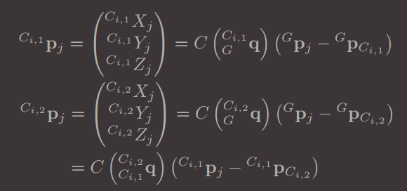
- 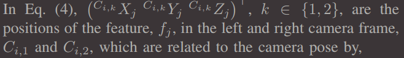
- $\mathbf{z}_{i}^{j}=\left( \begin{array}{c}{u_{i, 1}^{j}} \\ {v_{i, 1}^{j}} \\ {u_{i, 2}^{j}} \\ {v_{i, 2}^{j}}\end{array}\right)=\left( \begin{array}{cc}{\frac{1}{C_{i, 1} Z_{j}}} & {\mathbf{0}_{2 \times 2}} \\ {\mathbf{0}_{2 \times 2}} & {\frac{1}{C_{i, 2} Z_{j}}}\end{array}\right) \left( \begin{array}{c}{^{C_{i, 1}} X_{j}} \\ {^{C_{i, 1}} Y_{j}} \\ {^{C_{i, 2}} X_{j}} \\ {^{C_{i, 2}} X_{j}}\end{array}\right) = \left( \begin{array}{c} {\frac{^{C_{i, 1}} X_{j}}{C_{i, 1} Z_{j}}}  \\  {\frac{^{C_{i, 1}} Y_{j}}{C_{i, 1} Z_{j}}} \\ {\frac{^{C_{i, 2}} X_{j}}{C_{i, 2} Z_{j}}}  \\  {\frac{^{C_{i, 2}} Y_{j}}{C_{i, 2} Z_{j}}} \end{array}  \right)​$
- $\mathbf{r}_{i}^{j}=\mathbf{z}_{i}^{j}-\hat{\mathbf{z}}_{i}^{j} = \mathbf{H}_{C_{i}}^{j} \tilde{\mathbf{x}}_{C_{i}}+\mathbf{H}_{f_{i}}^{j} \ _{}^{G}\tilde{p}_{j}+\mathbf{n}_{i}^{j}​$  
  - $\mathbf{H}_{C_{i}}^{j}=\frac{\partial \mathbf{z}_{i}^{j}}{\partial^{C_{i, 1}} \mathbf{p}_{j}} \cdot \frac{\partial^{C_{i, 1}} \mathbf{p}_{j}}{\partial \mathbf{x}_{C_{i, 1}}}+\frac{\partial \mathbf{z}_{i}^{j}}{\partial^{C_{i, 2}} \mathbf{p}_{j}} \cdot \frac{\partial^{C_{i, 2}} \mathbf{p}_{j}}{\partial \mathbf{x}_{C_{i, 1}}}$   (其中$^Gp_j$ 是由多个相关相机状态估计的，同时也与观测到该特征点的相机位姿$x_{c_{i,1}}$有关，)        $\mathbf{H}_{f_{i}}^{j}=\frac{\partial \mathbf{z}_{i}^{j_{i}}}{\partial ^{C_{i, 1}} \mathbf{p}_{j}  } \cdot \frac{\partial^{C_{i, 1}} \mathbf{p}_{j}}{\partial^{G} \mathbf{p}_{j}}+\frac{\partial \mathbf{z}_{i}^{j}}{\partial^{C_{i, 2}} \mathbf{p}_{j}} \cdot \frac{\partial^{C_{i, 2}} \mathbf{p}_{j}}{\partial^{G} \mathbf{p}_{j}}$
  - $\frac{\partial \mathbf{z}_{i}^{j}}{\partial^{C_{i, 1} }\mathbf{p}_{j}}=\frac{1}{C_{i, 1} \hat{Z}_{j}} \left( \begin{array}{ccc}{1} & {0} & {-\frac{  ^{C_{i, 1}} \hat{X}_{j} } {^{C_{i, 1}} \hat{Z}_{j}}} \\ {0} & {1} & {-\frac{ ^{C_{i, 1}} \hat{Y}_{j}}{^{C_{i, 1}} \hat{Z}_{j}}} \\ {0} & {0} & {0} \\ {0} & {0} & {0}\end{array}\right)​$      $\frac{\partial \mathbf{z}_{i}^{j}}{\partial^{C_{i, 2}} \mathbf{p}_{j}}=\frac{1}{ ^{C_{i, 2}} \hat{Z}_{j}} \left( \begin{array}{ccc}{0} & {0} & {0} \\ {0} & {0} & {0} \\ {1} & {0} & {-\frac{ ^{C_{i, 2}} \hat{X}_{j}}{ ^{C_{i, 2}} \hat{Z}_{j}}} \\ {0} & {1} & {-\frac{^{C_{i, 2}} \hat{Y}_{j}}{^{C_{i, 2}} \hat{Z}_{j}}}\end{array}\right)​$
  - $\frac{\partial^{C_{i, 1}} \mathbf{p}_{j}}{\partial \mathbf{x}_{C_{i, 1}}}=\left(\left\lfloor^{C_{i, 1}} \hat{\mathbf{p}}_{j \times}\right\rfloor \; -C \left( ^{C_{i, 1}}  _{G} \hat{q} \right)\right)​$       $\frac{\partial^{C_{i, 1}} \mathbf{p}_{j}}{\partial^{G} \mathbf{p}_{j}}=C\left(_{G}^{C_{i, 1}} \hat{\mathbf{q}}\right)​$ 
  - $\frac{\partial^{C_{i, 2}} \mathbf{p}_{j}}{\partial \mathbf{x}_{C_{i, 1}}} = C \left( ^{C_{i, 1}} _{C_{i, 2}} \mathbf{q} \right)^{\top} \left(\left\lfloor^{C_{i, 1}} \hat{\mathbf{p}}_{j \times}\right\rfloor- C \left( ^{C_{i, 1}}_{G} \hat{q} \right)\right)​$     $\frac{\partial^{C_{i, 2}} \mathbf{p}_{j}}{\partial^{G} \mathbf{p}_{j}}=C\left(_{C_{i, 2}}^{C_{i, 1}} q\right)^{\top} C\left(_{G}^{C_{i, 1}} \hat{q}\right)​$
- 一个特征点被多个相机状态观察到。堆叠多个观察可得：  $\mathbf{r}^{j}=\mathbf{H}_{\mathbf{x}}^{j} \tilde{\mathbf{x}}+\mathbf{H}_{f}^{j} {^{G}\tilde{\mathbf{p}}_{j}}+\mathbf{n}^{j}$ 
- $^{G} \mathbf{p}_{j}​$ 是由相关的相机状态求得的，它的不确定性也与这些相机状态有关系 。 为了不让$^G\mathbf{P}_j​$的不确定性影响到残差。将观测方程投影到$\mathbf{H}_f^i​$的零空间$V​$。 $\mathbf{r}_{o}^{j}=\mathbf{V}^{\top} \mathbf{r}^{j}=\mathbf{V}^{\top} \mathbf{H}_{\mathbf{x}}^{j} \tilde{\mathbf{x}}+\mathbf{V}^{\top} \mathbf{n}^{j}=\mathbf{H}_{\mathbf{x}, o}^{j} \tilde{\mathbf{x}}+\mathbf{n}_{o}^{j}​$   (the update step of the EKF can be carried out in a standard way.)
- 


## 筛选出待更新的视觉约束关系并计算观测矩阵H

- 筛选约束关系： 
  - removeLostFeatures是根据特征点来选  
    - invalid_features: 当前帧跟丢，checkMotion未通过，三角化未成功
    - tracked_features:当前帧跟踪上
    - valid_features: 前两者之外的所有点
  - pruneCamStateBuffer是根据移除的相机状态来选 
    - 移除旧的还是新的？
- 计算观测矩阵H和残差r


```c++
void MsckfVio::removeLostFeatures() {
  // ...
  
  // Process the features which lose track.
  // 对跟踪到的特征点进行处理
  for (const auto& feature_id : processed_feature_ids) {
    auto& feature = map_server[feature_id];

    vector<StateIDType> cam_state_ids(0);
    for (const auto& measurement : feature.observations)
      cam_state_ids.push_back(measurement.first);

    MatrixXd H_xj;
    VectorXd r_j;
    // 计算特征点单个相机位姿的雅克比和残差方程
    featureJacobian(feature.id, cam_state_ids, H_xj, r_j);

    // gatingTest为卡方检验，检验通过将当前雅克比矩阵和残差压缩
    if (gatingTest(H_xj, r_j, cam_state_ids.size()-1)) {
      H_x.block(stack_cntr, 0, H_xj.rows(), H_xj.cols()) = H_xj;
      r.segment(stack_cntr, r_j.rows()) = r_j;
      stack_cntr += H_xj.rows();
    }

    // Put an upper bound on the row size of measurement Jacobian,
    // which helps guarantee the executation time.
    //
    if (stack_cntr > 1500) break;
  }

  // 扩展当前特征点的协方差和残差向量
  H_x.conservativeResize(stack_cntr, H_x.cols());
  r.conservativeResize(stack_cntr);

  // Perform the measurement update step.
  // 执行量测更新
  measurementUpdate(H_x, r);
    
  // ...

｝
```


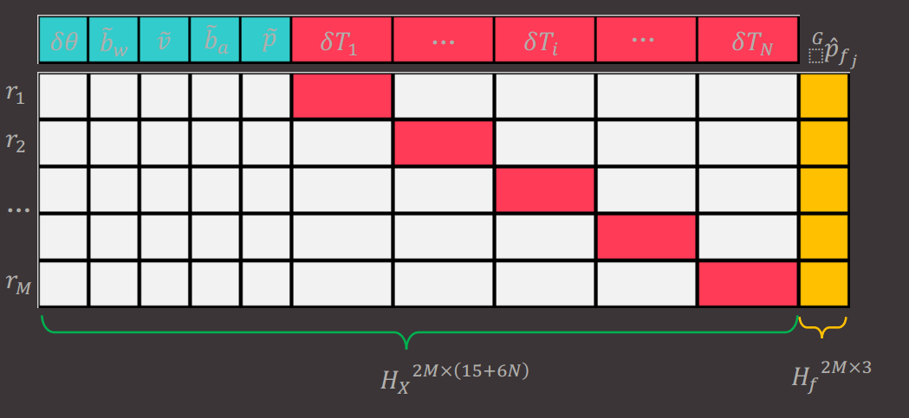

```c++
/**
 * @brief 计算某个特征点对应所有的相机测量的雅克比，并消除Hf
 * @param  feature_id 某个特征标号
 * @param  cam_state_ids 一组相机状态
 * @param  H_x  雅克比矩阵
 * @param  r   量测残差
 * @cite  S-MSCKF Appendx C
 */
void MsckfVio::featureJacobian(
    const FeatureIDType& feature_id,
    const std::vector<StateIDType>& cam_state_ids,
    MatrixXd& H_x, VectorXd& r) {

  const auto& feature = map_server[feature_id];

  // Check how many camera states in the provided camera
  // id camera has actually seen this feature.
  // 将当前能观测到当前特征点的相机对应的标号保存到valid_cam_state_ids==>Mj
  vector<StateIDType> valid_cam_state_ids(0);
  for (const auto& cam_id : cam_state_ids) {
    if (feature.observations.find(cam_id) ==
        feature.observations.end()) continue;

    valid_cam_state_ids.push_back(cam_id);
  }

  // 每个相机状态（双目）会提供4行维度 每个相机有４个观测值
  int jacobian_row_size = 0;
  jacobian_row_size = 4 * valid_cam_state_ids.size();

  // H_xj: 观测方程对系统状态的雅克比矩阵： 4M*(21+N*6)
  // H_fj: 观测方程对特征点的雅克比矩阵： 4M*3
  // r_j: 观测残差： 4M*1
  MatrixXd H_xj = MatrixXd::Zero(jacobian_row_size,
      21+state_server.cam_states.size()*6);
  MatrixXd H_fj = MatrixXd::Zero(jacobian_row_size, 3);
  VectorXd r_j = VectorXd::Zero(jacobian_row_size);
  int stack_cntr = 0;

  // 对该特征下的某个相机位姿计算对应的雅克比矩阵
  // 计算得到的单个雅克比再压缩
  for (const auto& cam_id : valid_cam_state_ids) {
    // 每个相机位姿对应的雅克比矩阵维度
    Matrix<double, 4, 6> H_xi = Matrix<double, 4, 6>::Zero();
    Matrix<double, 4, 3> H_fi = Matrix<double, 4, 3>::Zero();
    Vector4d r_i = Vector4d::Zero();
    // 计算某个特征对应的单个相机位姿的雅克比和残差
    measurementJacobian(cam_id, feature.id, H_xi, H_fi, r_i);

    auto cam_state_iter = state_server.cam_states.find(cam_id);
    int cam_state_cntr = std::distance(
        state_server.cam_states.begin(), cam_state_iter);

    // Stack the Jacobians.
    // 将当前特征的所有相机位姿对应的雅克比都压缩在一个矩阵
    H_xj.block<4, 6>(stack_cntr, 21+6*cam_state_cntr) = H_xi;
    H_fj.block<4, 3>(stack_cntr, 0) = H_fi;
    r_j.segment<4>(stack_cntr) = r_i;
    stack_cntr += 4;
  }

  // Project the residual and Jacobians onto the nullspace
  // of H_fj.
  // Hf的左零空间为该矩阵SVD分解后，对应的U的最后几列
  JacobiSVD<MatrixXd> svd_helper(H_fj, ComputeFullU | ComputeThinV);
  MatrixXd A = svd_helper.matrixU().rightCols(
      jacobian_row_size - 3); /// 4Mj-3

  // 将状态雅克比矩阵和残差向量映射到Hf的左零空间中
  H_x = A.transpose() * H_xj; /// equation (6)
  r = A.transpose() * r_j; /// noise???

  return;
}
```


```c++
// This function is used to compute the measurement Jacobian
// for a single feature observed at a single camera frame.
/**
* @brief 计算某个特征点的单个相机状态对应的雅克比和归一化相机坐标系的残差
* 
* @param cam_state_id 某个相机状态
* @param feature_id 某个特征
* @param H_x 状态的雅克比
* @param H_f 特征位置的雅克比
* @param r 当前特征的量测残差
*/ 
void MsckfVio::measurementJacobian(
    const StateIDType& cam_state_id,
    const FeatureIDType& feature_id,
    Matrix<double, 4, 6>& H_x, Matrix<double, 4, 3>& H_f, Vector4d& r) {

  // Prepare all the required data.
  const CAMState& cam_state = state_server.cam_states[cam_state_id];
  const Feature& feature = map_server[feature_id];

  // 两个相机的位姿（左边相机通过imu计算得到）
  // Cam0 pose.
  Matrix3d R_w_c0 = quaternionToRotation(cam_state.orientation);
  const Vector3d& t_c0_w = cam_state.position;

  // 右边的相机位姿可通过两个相机的外参计算得到
  // Cam1 pose.
  Matrix3d R_c0_c1 = CAMState::T_cam0_cam1.linear();
  Matrix3d R_w_c1 = CAMState::T_cam0_cam1.linear() * R_w_c0;
  Vector3d t_c1_w = t_c0_w - R_w_c1.transpose()*CAMState::T_cam0_cam1.translation();

  // 3d feature position in the world frame.
  // And its observation with the stereo cameras.
  // p为地图点在世界坐标系下的位置
  // z为观测
  const Vector3d& p_w = feature.position;
  const Vector4d& z = feature.observations.find(cam_state_id)->second;

  // Convert the feature position from the world frame to
  // the cam0 and cam1 frame.
  // 将三维点的坐标由世界坐标系转换到相机坐标系
  Vector3d p_c0 = R_w_c0 * (p_w-t_c0_w);
  Vector3d p_c1 = R_w_c1 * (p_w-t_c1_w);

  // Compute the Jacobians.
  // Hc = z'/cp' * cp'/x'  Hf  = z'/ cp' * cp'/gp'
  // z'/cp'
  Matrix<double, 4, 3> dz_dpc0 = Matrix<double, 4, 3>::Zero();
  dz_dpc0(0, 0) = 1 / p_c0(2);
  dz_dpc0(1, 1) = 1 / p_c0(2);
  dz_dpc0(0, 2) = -p_c0(0) / (p_c0(2)*p_c0(2));
  dz_dpc0(1, 2) = -p_c0(1) / (p_c0(2)*p_c0(2));

  Matrix<double, 4, 3> dz_dpc1 = Matrix<double, 4, 3>::Zero();
  dz_dpc1(2, 0) = 1 / p_c1(2);
  dz_dpc1(3, 1) = 1 / p_c1(2);
  dz_dpc1(2, 2) = -p_c1(0) / (p_c1(2)*p_c1(2));
  dz_dpc1(3, 2) = -p_c1(1) / (p_c1(2)*p_c1(2));

  // cp'/x'
  Matrix<double, 3, 6> dpc0_dxc = Matrix<double, 3, 6>::Zero();
  dpc0_dxc.leftCols(3) = skewSymmetric(p_c0);
  dpc0_dxc.rightCols(3) = -R_w_c0;

  Matrix<double, 3, 6> dpc1_dxc = Matrix<double, 3, 6>::Zero();
  dpc1_dxc.leftCols(3) = R_c0_c1 * skewSymmetric(p_c0);
  dpc1_dxc.rightCols(3) = -R_w_c1;

  Matrix3d dpc0_dpg = R_w_c0;
  Matrix3d dpc1_dpg = R_w_c1;

  // 公式见论文
  H_x = dz_dpc0*dpc0_dxc + dz_dpc1*dpc1_dxc;
  H_f = dz_dpc0*dpc0_dpg + dz_dpc1*dpc1_dpg;

  // Modifty the measurement Jacobian to ensure
  // observability constrain.
  // 可观测性约束，见论文《Observability-constrained vision-aided inertial navigation》
  Matrix<double, 4, 6> A = H_x;
  Matrix<double, 6, 1> u = Matrix<double, 6, 1>::Zero();
  u.block<3, 1>(0, 0) = quaternionToRotation(
      cam_state.orientation_null) * IMUState::gravity;
  u.block<3, 1>(3, 0) = skewSymmetric(
      p_w-cam_state.position_null) * IMUState::gravity;
  H_x = A - A*u*(u.transpose()*u).inverse()*u.transpose();
  H_f = -H_x.block<4, 3>(0, 3);

  // Compute the residual.
  // 计算残差： 真值减去估计的值
  r = z - Vector4d(p_c0(0)/p_c0(2), p_c0(1)/p_c0(2),
      p_c1(0)/p_c1(2), p_c1(1)/p_c1(2));

  return;
}
```


## 计算增益K以及误差状态的后验估计和协方差

- $\mathbf{K}=\mathbf{P} \mathbf{H}^{\top}\left(\mathbf{H P H}^{\top}+\mathbf{V}\right)^{-1}​$ 观测域变换到状态域同时考虑增益g
- 计算误差状态后验估计，因为由标准EKF: $\hat{x}_k = \bar{x}_k + K(z_k - h(\bar{x}_k))$)  可得$\hat{\delta{x}} = \hat{x}_k - \bar{x}_k = K(z_k - h(\bar{x}_k))=Kr$ 
- 计算误差状态后验估计协方差，$\mathbf{P} \leftarrow(\mathbf{I}-\mathbf{K} \mathbf{H}) \mathbf{P}​$   P是预测的 真实系统状态的协方差(其实就是误差状态的协方差 因为标准状态是确定量)。可以用更复杂的形式例如 
  - 1. the symmetric and positive Joseph form  $\mathbf{P} \leftarrow(\mathbf{I}-\mathbf{K} \mathbf{H}) \mathbf{P}(\mathbf{I}-\mathbf{K} \mathbf{H})^{\top}+\mathbf{K} \mathbf{V} \mathbf{K}^{\top}​$    更符合 \hat{x_k} = \bar{x_k} + K(z_k - h(\bar{x_k})) = \bar{x_k} + K( \frac{\partial h}{ \partial x_k } (z_k - \bar{x_k}) + v) =( 1-KH)\bar{x_k} +Kv+ KHz_k$ 
    2. the symmetric form $\mathbf{P} \leftarrow \mathbf{P}-\mathbf{K}\left(\mathbf{H} \mathbf{P} \mathbf{H}^{\top}+\mathbf{V}\right) \mathbf{K}^{\top}$ 


```c++
void MsckfVio::measurementUpdate(
    const MatrixXd& H, const VectorXd& r) {
  
  // Compute the Kalman gain.
  // 计算卡尔曼滤波增益
  // K = P * H_thin^T * (H_thin*P*H_thin^T + Rn)^-1
  // K * (H_thin*P*H_thin^T + Rn) = P * H_thin^T
  // -> (H_thin*P*H_thin^T + Rn)^T * K^T = H_thin * P^T
  const MatrixXd& P = state_server.state_cov;
  MatrixXd S = H_thin*P*H_thin.transpose() +
      Feature::observation_noise*MatrixXd::Identity(
        H_thin.rows(), H_thin.rows());
  //MatrixXd K_transpose = S.fullPivHouseholderQr().solve(H_thin*P);
  // P^T = P!!!
  MatrixXd K_transpose = S.ldlt().solve(H_thin*P);
  MatrixXd K = K_transpose.transpose();

  // Compute the error of the state.
  // 状态误差矫正
  VectorXd delta_x = K * r_thin;
  
  // Update state covariance.
  MatrixXd I_KH = MatrixXd::Identity(K.rows(), H_thin.cols()) - K*H_thin;
  //state_server.state_cov = I_KH*state_server.state_cov*I_KH.transpose() +
  //  K*K.transpose()*Feature::observation_noise;
  state_server.state_cov = I_KH*state_server.state_cov;

  // Fix the covariance to be symmetric
  MatrixXd state_cov_fixed = (state_server.state_cov +
      state_server.state_cov.transpose()) / 2.0;
  state_server.state_cov = state_cov_fixed;

  return;
}
```


## 更新nominal-state并重置error-state

**用误差状态修正标准状态**

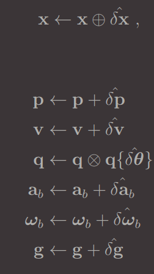


```c++
// Update the IMU state.
  //更新imu的状态
  // 取delta_x向量中前21个元素，即imu的状态
  const VectorXd& delta_x_imu = delta_x.head<21>();

  // 取delta_x_imu向量中第6个元素后的三个元素（4 5 6）
  // 取delta_x_imu向量中第12个元素后的三个元素（13 14 15）
  // 这两个子向量是imu的速度和位置，如果更新矫正的值过大则警告
  if (//delta_x_imu.segment<3>(0).norm() > 0.15 ||
      //delta_x_imu.segment<3>(3).norm() > 0.15 ||
      delta_x_imu.segment<3>(6).norm() > 0.5 ||
      //delta_x_imu.segment<3>(9).norm() > 0.5 ||
      delta_x_imu.segment<3>(12).norm() > 1.0) {
    printf("delta velocity: %f\n", delta_x_imu.segment<3>(6).norm());
    printf("delta position: %f\n", delta_x_imu.segment<3>(12).norm());
    ROS_WARN("Update change is too large.");
    //return;
  }

  // 分别更新Imu的四元数、陀螺仪偏置、速度、加速度偏置和位置
  // 更新四元数，四元数乘法：
  // 更新陀螺仪偏置：b_g = b_g + δb_g
  // 更新imu速度：v = v + δv
  // 更新加速度偏置：b_a = b_a + δb_a
  // 更新imu位置：p = p + δp
  const Vector4d dq_imu =
    smallAngleQuaternion(delta_x_imu.head<3>());
  state_server.imu_state.orientation = quaternionMultiplication(
      dq_imu, state_server.imu_state.orientation);
  state_server.imu_state.gyro_bias += delta_x_imu.segment<3>(3);
  state_server.imu_state.velocity += delta_x_imu.segment<3>(6);
  state_server.imu_state.acc_bias += delta_x_imu.segment<3>(9);
  state_server.imu_state.position += delta_x_imu.segment<3>(12);

  // 更新相机与Imu之间的外参数
  const Vector4d dq_extrinsic =
    smallAngleQuaternion(delta_x_imu.segment<3>(15));
  state_server.imu_state.R_imu_cam0 = quaternionToRotation(
      dq_extrinsic) * state_server.imu_state.R_imu_cam0;
  state_server.imu_state.t_cam0_imu += delta_x_imu.segment<3>(18);

  // Update the camera states.
  // 更新状态向量x中所有的相机状态
  auto cam_state_iter = state_server.cam_states.begin();
  for (int i = 0; i < state_server.cam_states.size();
      ++i, ++cam_state_iter) {
    // 更新第i个相机状态
    // 
    const VectorXd& delta_x_cam = delta_x.segment<6>(21+i*6);
    const Vector4d dq_cam = smallAngleQuaternion(delta_x_cam.head<3>());
    cam_state_iter->second.orientation = quaternionMultiplication(
        dq_cam, cam_state_iter->second.orientation);
    cam_state_iter->second.position += delta_x_cam.tail<3>();
  }
```


**重置误差状态**

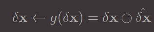 = $g( \bar{ \delta x }) + \frac{\partial g}{ \partial {\delta x} } \Bigr|_{\bar{ \delta x }} ( \delta x - \bar{ \delta x } ) = g( \bar{ \delta x }) + G( \delta x - \bar{ \delta x } )​$

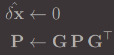

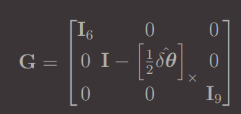


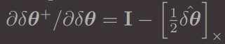 细节请看《Quaternion kinematics for the error-state Kalman filter 》6.3.1 

但是$\delta \theta$一般可以忽略，代码实现中一般直接使用$G=I_{18}$ 


h
